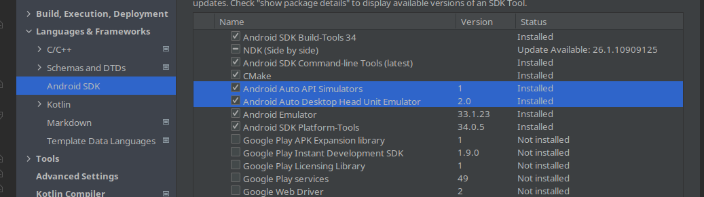
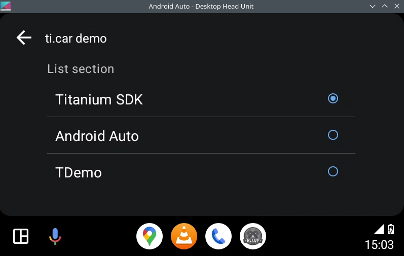

# ti.car

Use Android Auto (Android Car) with Titanium SDK.

For Apple CarPlay visit https://github.com/hansemannn/titanium-carplay/

## Requirements

* Add this to your tiapp.xml
  ```xml
  <uses-sdk android:minSdkVersion="23" />

  <application>

    <meta-data android:name="com.google.android.gms.car.application" android:resource="@xml/automotive_app_desc"/>
    <meta-data android:name="com.google.android.gms.car.notification.SmallIcon" android:resource="@drawable/carIcon"/>

  </application>
  ```
* create app/platform/android/res/xml/automotive_app_desc.xml
  ```xml
  <automotiveApp>
      <uses name="template"/>
  </automotiveApp>
  ```

#### Testing:
* Download Android Auto simulators and head unit. Use Android Studio for this:
  

* Attach your phone and run `[android sdk folder]/extras/google/auto/desktop-head-unit --usb`

## Methods

* createListTemplate()
* createMessageTemplate()
* createToast()

## Events

* click

## Example

#### List template:


```js
var car = require("ti.car");
car.createListTemplate({
	title: "ti.car demo",
	sections: [{
		title: "List section",
		items: [{
				text: "Titanium SDK"
			},
			{
				text: "Android Auto"
			},
			{
				text: "TDemo"
			}
		]
	}]
});


car.addEventListener("click", function(ev) {
	alert(ev.index);
	car.createToast("You clicked: " + ev.index);
})
```

#### Simple message:


```js
car.createMessageTemplate({
	title: "ti.car demo",
	text: "Hello from Titanium SDK"
})
```
